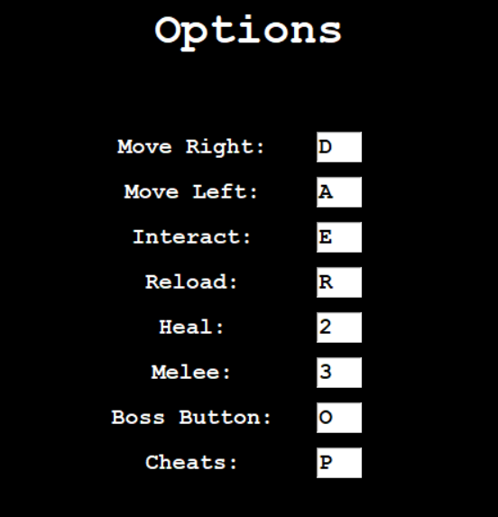

# ☢️🐱 Nuclear Whiskers  

An **exciting survival platformer** set in a **post-apocalyptic world**, where you raid bunkers for supplies. But be careful... you're not alone down there.  

🕹️ **Survive. Explore. Fight.** How deep can you go before it's too late?  

This game was created as a **first-year university project** for an **Introduction to Programming** coursework. It was built in **Python** using **Tkinter**.  

---

## 🎥 Demo  
**Gameplay Preview:**  
  

**Main Menu Navigation:**  
  

---

## 🏆 Features  
- ⚔️ **Fight off enemies** and descend further into the bunker!  
- 🔫 **Manage your ammo and health** wisely – resources are limited...  
- 🎨 **Handmade pixel art animations** for a retro feel!  
- 📜 **Save your high scores** and compete with friends!  
- ⏸️ **Pause & Save your game** and continue later!  
- 🎮 **Customizable controls** for a tailored experience!  

---

## 🚀 Installation  
1️⃣ Clone the repository:  
```sh
git clone https://github.com/blakeldridge/BunkerGame.git
cd BunkerGame
```

2️⃣ Install Dependencies:
```sh
    pip install tkinter pillow
```

3️⃣ Run the Game:
```sh
    python game_solution.py
```

🎮 How To Play
- Move Left (A) & Right (D)
- Aim with Mouse, Shoot with Left Click
- Kill all enemies to descend levels
- Pick up Supplies:
    - 🩹 Bandages → Heal (Press 2)
    - 🔄 Reload → Refill ammo (Press R)
- Score as high as possible before you die!

**Controls Layout:**


## 🔧 Technologies Used
- 🐍 Python
- 🖼️ Tkinter (GUI framework)
- 🖌️ PIL (Image manipulation)

## 📬 Contact
Created by **[Blake Eldridge](https://github.com/blakeldridge)** - Feel free to reach out! <br>
📧 **Email** : blakeldridge@gmail.com <br>
💼 **LinkedIn** : [blakeldridge](https://www.linkedin.com/in/blake-eldridge/)
